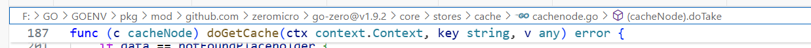
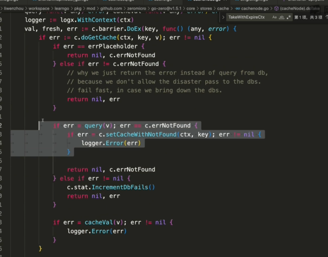

# 短连接项目
1. 先建个数据库
2.搭建gozero骨架
a.编写api文件 使用goctl生成代码
3.根据数据表生成model层代码 short—url-map 进行数据库操作
goctl model mysql datasource -url="root:666666@tcp(127.0.0.1:3306)/db1" -table="short_url_map" -dir="./model"
//
goctl model mysql datasource -url="root:666666@tcp(127.0.0.1:3306)/db1" -table="sequence" -dir="./model"
##参数校验
1.引入validator

##查看短连接
### 缓存版本
有两种方式
1.使用自己实现的缓存 surl-lurl 节省缓存数据量
2.go-zero自带的 surl-数据行 开发量小
使用第二种方案：
1.添加配置
    -配置文件
    -配置config结构体
2.删除旧的model层
    -删除shorturlmapmodel.go
3.重新生成model层代码
goctl model mysql datasource -url="root:666666@tcp(127.0.0.1:3306)/db1" -table="short_url_map" -dir="./model" -c
//天然signlegth

